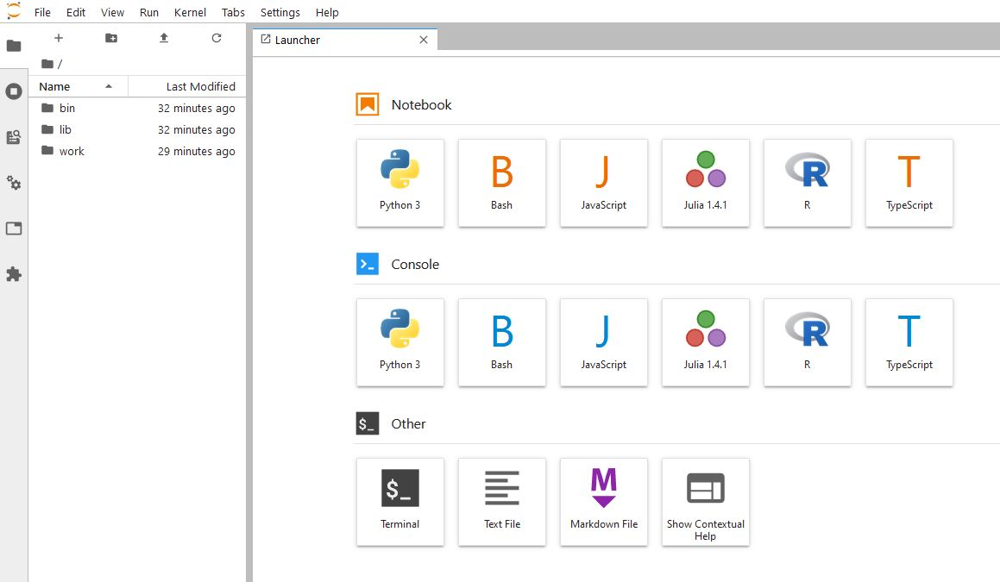

# jupyter-typescript

A Docker image of Jupyter notebook
which includes [tslab](https://github.com/yunabe/tslab) (Node.js and TypeScript kernel) and [bash_kernel](https://github.com/takluyver/bash_kernel)
on the official docker image [jupyter/datascience-notebook](https://jupyter-docker-stacks.readthedocs.io/en/latest/using/selecting.html#jupyter-datascience-notebook).


## Usage

Start the server as follows:

```
docker run --rm \
-p 10000:8888 \ 
-e JUPYTER_ENABLE_LAB=yes \
-v "$PWD":/home/jovyan/work \
oogasawa/jupyter-typescript
```

## Screenshots


